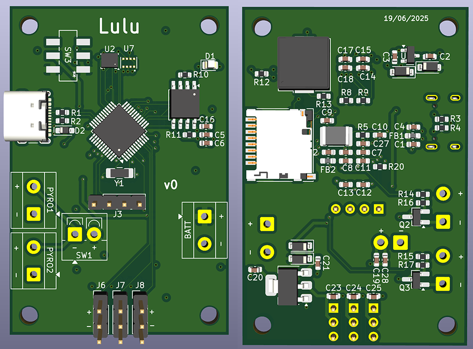
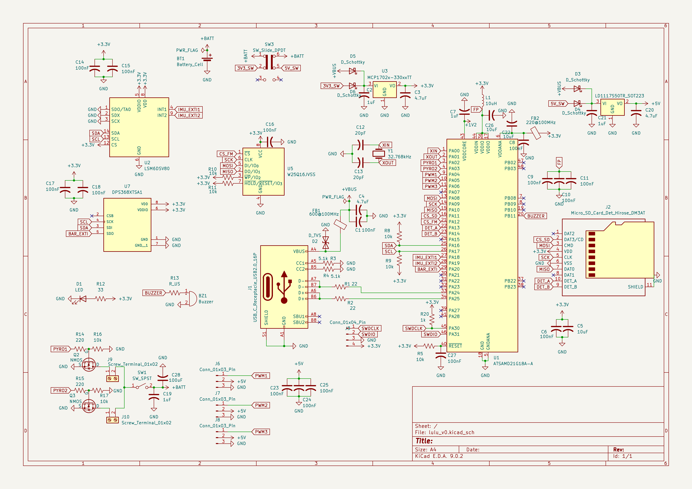

# Lulu (v1)

## Introduction
Lulu is a simple model rocket flight computer primarily designed to record and store flight data for analysis and testing. It also designed with the ability to deploy parachutes through pyrotechnic charges and has limited potential for implementing control systems through 3 broken out PWM pins.

This document discusses the design of the chip and the reasoning behind these decisions. Please refer to the [schematic](lulu_v0_schematic.pdf) for exact connections.

# Design
## Hardware
Lulu is designed as a 4 layer FR-4 PCB with 4 copper poors. 
- Top layer net: Battery positive voltage
- First internal net: Common ground plane
- Second internal net: 3.3V supply
- Bottom layer net: VBus from USB (5V)

### Processor
The flight computer is based on the [SAMD21G18](https://ww1.microchip.com/downloads/en/DeviceDoc/SAM_D21_DA1_Family_DataSheet_DS40001882F.pdf) microcontroller (MCU). This chip was chosen for 2 primary reasons: Arduino compatibility and community support. I want this board to be easily used/reprogrammed and extended by many amateur rocketeers, so it was important to choose a processor with a large ecosystem around it.

### Programming interface
The is designed to board supports programming over **USB-C**. The SAMD21 has an Arduino compatible bootloader that can be loaded on to it that should make it possible to program in the Arduino IDE.

The board also exposes the MCU's SWD (Serial Wire Debug) pins to make debug programming possible as well.
### Power
The board is designed to be powered by either a 9V battery, or preferable a 2-3s LiPo battery. A screw terminal is provided for the battery connection.

The MCU itself, as well as most of the sensors, require a 3.3V power supply. To regulate the 7-12V battery input into a stable 3.3V for the board, I use a [MCP1702-3302](https://ww1.microchip.com/downloads/en/DeviceDoc/22008E.pdf) LDO (Low Drop Out) voltage regulator which can provide up to 250mA of current to the MCU and all sensors. This was chosen for it's input voltage range (2.7-13.2V) and low inactive current rating (5 $\mu$A).

The USB-C input can also be used to power the board. It's voltage output (5V from VBUS) will also feed into the 1702 voltage regulator.

The board includes another voltage regulator (a [LDL1117S50](https://www.st.com/content/ccc/resource/technical/document/datasheet/group3/0e/5a/00/ca/10/1a/4f/a5/DM00366442/files/DM00366442.pdf/jcr:content/translations/en.DM00366442.pdf)) which can provide up to 1.2 A of current at 5V. This power line is meant to be used with servo motors via the broken out PWM pins. Tbh, the inclusion of this chip is an odd choice, but I will cover more that later.

Finally, there is a slide switch on the board which controls connects the voltage regulators to the battery to power the board on and off.
### Sensors
The board includes 2 main sensors. A 9-axis IMU (inertial measurement unit) which includes a low-G accelerometer, a high-G accelerometer and a gyroscope. There is also barometric pressure sensor.

The IMU chosen is the [LSM6DSV80XTR](https://mm.digikey.com/Volume0/opasdata/d220001/medias/docus/6678/LSM6DSV80X.pdf). This was selected because it combines both a low (+/- 16 G) and high (+/- 80 G) G accelerometer on the same chip. I though this would be useful since the rocket can experience G forces that could saturate the low-G accelerometer during peak acceleration.

The barometer is a [DPS368](https://www.infineon.com/dgdl/Infineon-DPS368-DS-v01_00-EN.pdf?fileId=5546d46269e1c019016a0c45105d4b40). This was honestly chosen quite arbitrarily, but it does have a 300 - 1200 hPa range and is stated to be "environmentally resistant", which I figured is ideal all things considered.

Both sensors are connected to the MCU via $I^{2}C$ on the same bus.
### Data Storage
Lulu's primary function is to record data. For that we have 2 storage methods: a micro SD card slot and a flash memory chip.

The flash memory chip is what will be written to during flight. Flash memory devices provide non-volatile storage (meaning data is not lost if power is cut unexpectedly) and fast access speeds. This makes them ideal for a rocket environment where things can go wrong at any time. The chip chosen is a 16M-bit [W25Q16JV](https://www.winbond.com/resource-files/w25q16jv%20spi%20revg%2003222018%20plus.pdf).

A [DM3D-SF](https://www.hirose.com/product/document?clcode=CL0609-0033-6-00&productname=DM3AT-SF-PEJ2M5&series=DM3&documenttype=Catalog&lang=en&documentid=D49662_en) SD card slot is included for permanent storage. Assuming the rocket touches down safely, the data will be transferred from the flash memory chip to the SD card to make it easier to interface with and read.

Both data storage connect to the MCU on the same SPI bus.
### Control Features
Lulu is designed with the ability to control certain features of the rocket it is onboard. The first is pyrotechnic charges for stage separation or parachute deployment. The second is for various motors that could be used for thrust-vector control (TVC) or other position/orientation control mechanisms.

There are 2 screw terminal inputs for e-matches on Lulu. Both of these are driven by their own MOSFET that the MCU can control. There is also a switch that must be turned on before the e-matches are connected to the battery.

3 PWM pins are broken out from the MCU and each has a + and - connectors that can connect an input to the 5V board supply. The intention was for these to be used with servo motors to implement TVC for the rocket. I am no longer sure that this is a good idea.
### Status Features
Finally the board is equipped with 2 components to help indicate the its status. These are an LED connected the output of the 3.3V regulator and a passive buzzer connected to a PWM pin of the MCU.

The LED simply indicates whether the MCU is getting power. The buzzer has the ability to play various sounds/patterns to indicate different statuses.
## Limitations
There are a few issues that I can see in this design after sitting with it for a while. Most of these have to do with design decisions that don't make sense with what I wan the computer to do.
### Wireless Communication
The first and most glaring issue is the lack of a method of wireless communication.

To perform safe and reliable launches of model rockets of any complexity, it is almost essential to have a connection between the ground station and the rocket. Ideally this is sustained for the duration of the flight, but at the very least it should exist before take off.

The wireless connections lets you monitor the status of your rocket before flight and ensure all its systems are good and it is safe to takeoff. Without this communication, you are essentially guessing, which is not ideal.
### Continuity
The board also lacks a way to check continuity on the pyro channels. Once again this leads to guess work on where your charges will fire or not. This makes it hard to tell if your rocket will return in one piece.
### Complexity
At this stage, I think the addition of the servo PWM pins and the second voltage regulator add unnecessary complexity to the board.

The original idea was to be able to support active control systems like TVC, but I think the most important thing for the first version of a flight computer like this is just to collect good data.

I think it's best to focus the first version of this board on saving and combining recorded data to produce good estimates of the state of the rocket at each point during flight. This includes altitude, velocity, angular acceleration, orientation etc. All of these values with be necessary to support active control systems in the future. Once I've gotten the code to record and track these values accurately, I will work on a new board that uses them to implement more active control systems

So for these reasons, I do not think I will be producing the current iteration of this board. But I will start work on a second version that addresses these issues and tries to simplify the design.

Stay tuned.