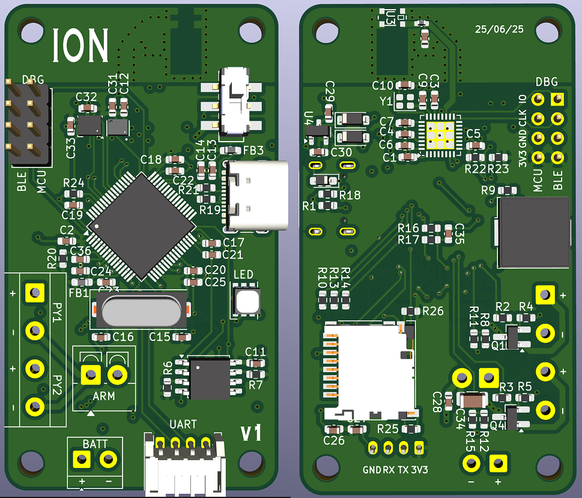
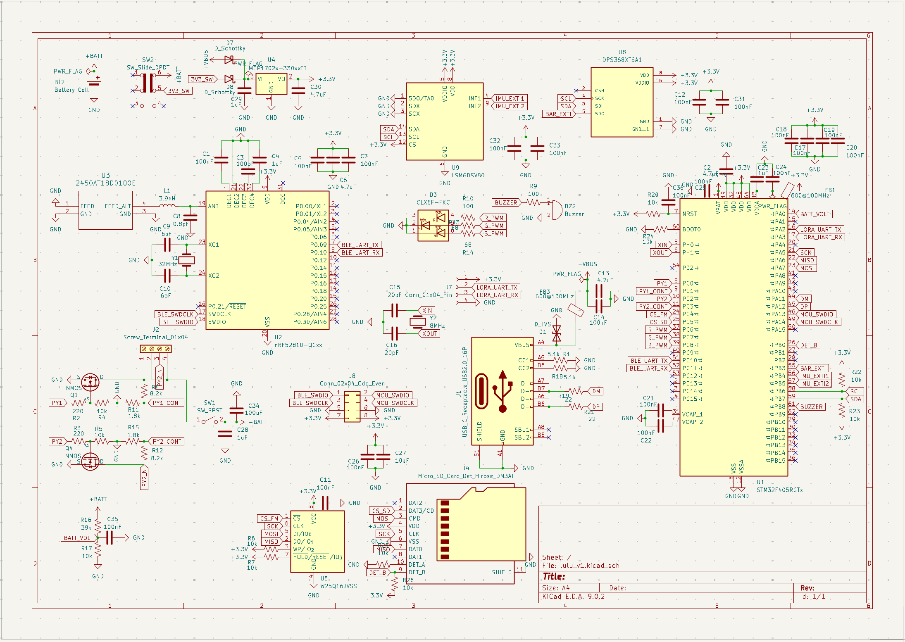

# Ion v1 (prev Lulu)

Design files [here](design_files/).

## Design
Most components and design choices on this board are the same as on [Lulu v0](../v0/README.md).

Core changes include:
- Different MCU
- Added Bluetooth chip
- Removed inputs for servos

Full write up describing changes coming soon.